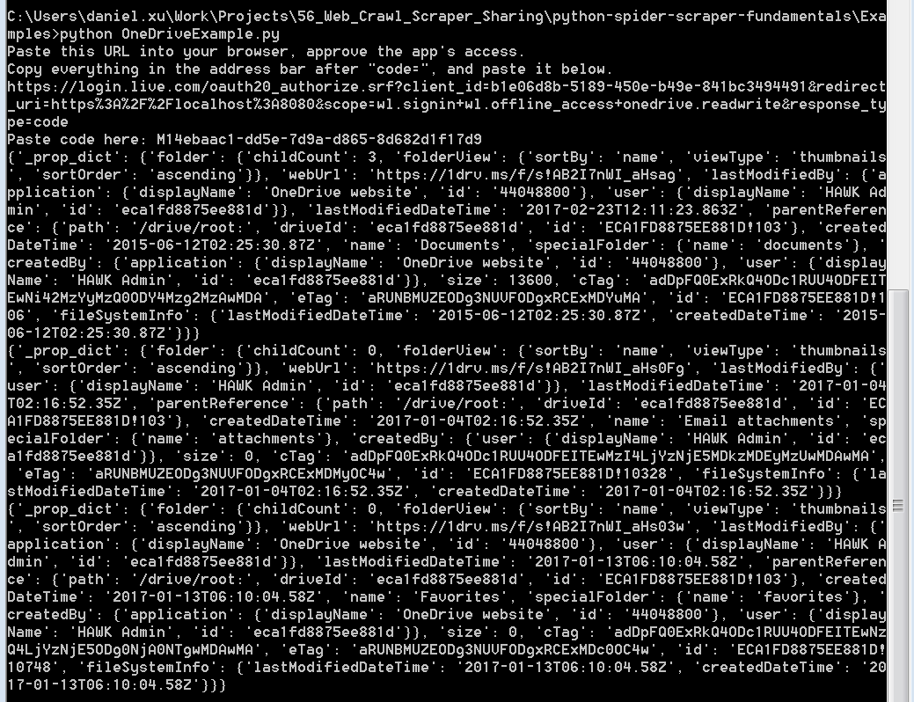

# Python Web Crawler and Scraper Fundamentals

## Content
1. Web crawler and scraper
2. HTTP Request: GET and POST
3. Capture and parse web via urllib
4. Powerful requests: HTTP for Humans
5. Web scraper framework: scrapy
6. Using API

## Prerequisite ##

* Python 3.5 or later version
* MongoDB (needed if you want to run the Scrapy example)

### 1. Web crawler and scraper
http://stackoverflow.com/questions/3207418/crawler-vs-scraper

A crawler get web pages from a starting page based one some rules or conditions. It downloads whatever it found.

A scraper extracts data from pages that we downloaded by a crawler, so that we can store them into databases or other data management systems.

### 2. HTTP Request: GET and POST
https://www.w3schools.com/tags/ref_httpmethods.asp

The Hypertext Transfer Protocol (HTTP) is designed to enable communications between clients and servers. HTTP works as a request-response protocol between a client and server. A web browser may be the client, and an application on a computer that hosts a web site may be the server.

Two commonly used methods for a request-response between a client and server are: GET and POST.

* GET - Requests data from a specified resource
* POST - Submits data to be processed to a specified resource

#### 2.1 The GET Method
Note that the query string (name/value pairs) is sent in the URL of a GET request:

`/test/demo_form.php?name1=value1&name2=value2`

Some other notes on GET requests:
* GET requests can be cached.
* GET requests remain in the browser history.
* GET requests can be bookmarked.
* GET requests should never be used when dealing with sensitive data.
* GET requests have length restrictions. The limit is dependent on both the server and the client used (and if applicable, also the proxy the server or the client is using).
* GET requests should be used only to retrieve data.

__Example__


#### 2.2 The POST Method
Note that the query string (name/value pairs) is sent in the HTTP message body of a POST request:

``````
POST /test/demo_form.php HTTP/1.1
Host: w3schools.com
name1=value1&name2=value2
``````

Some other notes on POST requests:
* POST requests are never cached.
* POST requests do not remain in the browser history.
* POST requests cannot be bookmarked.
* POST requests have no restrictions on data length.

__Example__


### 3. Capture and parse web page using urllib

Python has a standard package urllib for handling URLs. We can use it to write basic web crawler and scraper. 

- [`urllib.request`](https://docs.python.org/3.5/library/urllib.request.html#module-urllib.request) for opening and reading URLs
- [`urllib.error`](https://docs.python.org/3.5/library/urllib.error.html#module-urllib.error) containing the exceptions raised by [`urllib.request`](https://docs.python.org/3.5/library/urllib.request.html#module-urllib.request)
- [`urllib.parse`](https://docs.python.org/3.5/library/urllib.parse.html#module-urllib.parse) for parsing URLs
- [`urllib.robotparser`](https://docs.python.org/3.5/library/urllib.robotparser.html#module-urllib.robotparser) for parsing `robots.txt` files

```python
import urllib.request
import re

# Regex to match the repo name
REPO_REGEX = re.compile(b'.*/(.*/python).*', re.IGNORECASE, )

pythonRepo = urllib.request.urlopen(
    'https://github.com/search?utf8=%E2%9C%93&q=python&type=')
# The url we provided is for sending the query keyword to the web server via GET method.

# Save the response as a html file
# "wb" means the mode opening the file. "w" means open the file in write mode.
# "b" means open the file in binary mode.

with open('ResultPage.html', 'wb') as resultPage:
    resultPage.write(pythonRepo.read())

# Request the query again and find and print the repo name.
pythonRepo = urllib.request.urlopen(
    'https://github.com/search?utf8=%E2%9C%93&q=python&type=')

for line in pythonRepo:
    if REPO_REGEX.match(line):
        print(REPO_REGEX.match(line).group(1))
```


### 4. Powerful Requests: HTTP for Humans

[Requests](http://docs.python-requests.org/en/master/) is an elegant and simple HTTP library for Python, built for human beings. It is a powerful, safe and user-friendly library for handling HTTP requests and responses. Let's use it to submitting a post request and parse the response.

As it is not a standard library, install it via pip.

`pip install requests`

```python
import requests
from bs4 import BeautifulSoup # standard library for parsing html page

# header for simulating the browser
headers = {
    "User-Agent": "Mozilla/5.0 (Windows NT 6.1; WOW64; rv:52.0) Gecko/20100101 Firefox/52.0",
    "Accept": "application/json, text/javascript, */*; q=0.01",
    "Content-Type": "application/x-www-form-urlencoded; charset=UTF-8",
    "X-Requested-With": "XMLHttpRequest",
}

# creare a session to hold all browser information
gitSession = requests.Session()

# get the auth token from github login page
soup = BeautifulSoup(gitSession.get('https://github.com/login', 
    headers=headers).text,
    'html.parser')
# find the element containing the auth_token by selector
auth_token = soup.find("input", {"name": "authenticity_token"}).attrs['value']
print('auth_token: {}'.format(auth_token))

# prepare the login data using the auth token we got
payload = {
    "commit": "Sign in",
    "authenticity_token": auth_token,
    "login": "your login", # fill your username
    "password": "your password" # fill your password
}

# send a post request to session page to login
# we will need the session as Github request enable cookie and the session can
# help us to keep the cookie for different requests
login = gitSession.post('https://github.com/session', 
    data=payload)

# find my repo names by css selector
soup = BeautifulSoup(login.text, 'html.parser')
repos = soup.find_all("span", class_="repo")
for repo in repos:
    print(repo.text)
```


### 5. Web scraper framework: Scrapy

[Scrapy](https://docs.scrapy.org/en/latest/intro/overview.html) is an application framework for crawling web sites and extracting structured data which can be used for a wide range of useful applications, like data mining, information processing or historical archival.

You can use it to build distributed crawler system, use pipeline to process data captured and provide functions to handle exceptions and websites with anti-crawling mechanism.

Let's write a spider to crawl movie information from `THE MOVIE DB` and store it to MongoDB using item and pipeline.


As it is not a standard library, install it using pip.

`pip install scrapy`

You will also need `pymongo` to access your MongoDB.

`pip install pymongo`

Use below command to create a scrapy project.

`scrapy startproject tutorial`

This will create a `tutorial` directory with the following contents:

```
tutorial/
    scrapy.cfg            # deploy configuration file

    tutorial/             # project's Python module, you'll import your code from here
        __init__.py

        items.py          # project items definition file

        pipelines.py      # project pipelines file

        settings.py       # project settings file

        spiders/          # a directory where you'll later put your spiders
            __init__.py
```

Create a python file called `Movie.py` under `tutorial/spiders` folder.

__Item__ 

Item can help you to modeling the data you extracted from the web pages. It is very simple to define an item. As we are crawling movie data, we create a movie item by adding below codes to `items.py` file. It is very simple. You only need to define the field in a class inheriting `scrapy.Item` class. The fields are instance of `scrapy.Field` class. 

```python
import scrapy

class MovieItem(scrapy.Item):
    _id = scrapy.Field()
    movie = scrapy.Field()
    rating = scrapy.Field()
    release_date = scrapy.Field()
    genres = scrapy.Field()
    overview = scrapy.Field()
```
__Spider__

Spider is the core script for finding URL for next pages and scraping data. As we defined an item, we will populate the item using the data we got. Create the spider named `Movie.py` in `spiders` folder.

```python
import scrapy
from ..items import MovieItem # import the item we defined

class MovieSpider(scrapy.Spider):
    # this is the name of the spider,
    # it will be used when we want to start the cralwer
    name = "Movie" 
    start_urls = [
        'https://www.themoviedb.org/movie',
    ]

    def parse(self, response):
        # use css selector to locate the elements containing movie information
        # populate the item with data we got
        for movie in response.css('div.info'):
            mItem = MovieItem()
            mItem['_id'] = ('https://www.themoviedb.org' + 
                movie.css('p.flex a::attr("href")').extract_first())
            mItem['movie'] = movie.css('p.flex a::text').extract_first()
            mItem['rating'] = movie.css('span.vote_average::text').extract_first()
            mItem['release_date'] = movie.css('span.release_date::text').extract_first()
            mItem['genres'] = movie.css ('span.genres::text').extract_first()
            mItem['overview'] = movie.css ('p.overview::text').extract_first()
            yield mItem
        
        # return the url of next page
        next_page = response.css('p.right.pagination a::attr("href")').extract()
        if len(next_page) > 1:
            next_page = next_page[1]
        else:
            next_page = next_page[0]
        if next_page is not None:
            yield response.follow(next_page, self.parse)
```

__Pipeline__

Pipeline is a powerful module. We can use it to do data cleansing, dedup, formating and calculating before saving the data. We create a item pipeline that directly save the item into MongoDB. Add below codes to `pipelines.py` file.

```python
import pymongo

class MoviePipeline(object):
    # action that will be taken when the crawler started
    def open_spider(self, spider):
        # connect to local mongodb on port 27018, default port is 27017
        self.client = pymongo.MongoClient("mongodb://localhost:27018")
        # connect to database test
        self.test = self.client['test']
        # connect to collection Movie
        self.movie = self.test['Movie']
    
    def process_item(self, item, spider):
        # insert the item to mongodb
        self.movie.insert_one(item)
        return item

    def close_spider(self, spider):
        pass
```

Enable the item pipeline by adding below codes to `settings.py`.

```python
ITEM_PIPELINES = {
    'tutorial.pipelines.MoviePipeline': 300,
}
```

Start the crawler.

`scrapy crawl Movie`

__Finally!!__

It took me less than 20 minutes to crawled 19633 movies, not bad.


### 6. Using API ###

Many services, such as Google Map, OneDrive and Box, has provided official API for user to automatically some routine tasks. With API, we don't need to build the post or get request by ourself.

#### Box API ####

[boxsdk](https://pypi.python.org/pypi/boxsdk/1.5.3#authorization) is the official Box Python SDK package. It also uses OAuth2 for authentication. You need to use below command to install it.

`pip install boxsdk`

Below are some links that you may need.

[Documentation](http://box-python-sdk.readthedocs.io/en/latest/)

[Source Code](https://github.com/box/box-python-sdk)

[Box Developer Docs](https://developer.box.com/docs)

Before using box API, you need to create a box application following below [guide](https://developer.box.com/docs/getting-started-box-integration). You will create and get `clientId`, `clientSecret` and `redirectUri` that you need for the demo.


Below is some demo codes for create a test folder, upload an image to the newly created folder and get its shared link.

```python
import json
import requests
import webbrowser

from boxsdk import OAuth2
from boxsdk import Client

# Configuration
clientId = '' # input your client id
clientSecret = '' # input your client pass
tokenUrl = 'https://api.box.com/oauth2/token'
authUrl = 'https://account.box.com/api/oauth2/authorize'
redirectUri = 'http://localhost'
state = '' # input your state
getCodeType = 'code'
getTokenType = 'authorization_code'
refreshTokenType = 'refresh_token'


# First leg authetication, get the code for getting access token
def get_code(url, type, id, redirect, state):
    authUrl = (url + '?response_type='
                + type + '&client_id=' + id + '&state='
                + state + '&redirect_uri=' + redirect)
    webbrowser.open(authUrl, new=0)

    # Paste the code returned by box in browser address line after you grant access
    authCode = input("Please enter the auth code got form browser: ")
    return authCode

# Get access token
def get_access_refresh_token(url, type, code, id, secret, uri):
    resp = requests.post(
        url,
        data={'grant_type': type,
            'code': code,
            'client_id': id,
            'client_secret': secret,
            'redirect_uri:': uri,
        }
    )
    
    tokenData = json.loads(resp.text)
    print(tokenData)
    accessToken = tokenData['access_token']
    refreshToken = tokenData['refresh_token']
    return accessToken, refreshToken

# Using refresh token to get new access token if necessary

def refresh_token(url, type, id, secret, refreshToken):
    resp = requests.post(
        url,
        data={'grant_type': type,
            'client_id': id,
            'client_secret': secret,
            'refresh_token': refreshToken}
    )
    tokenData = json.loads(resp.text)
    accessToken = tokenData['access_token']
    refreshToken = tokenData['fresh_token']
    return accessToken, refreshToken
    
    
if __name__ == '__main__':
    authCode = get_code(authUrl, getCodeType, clientId, redirectUri, state)
    accessToken, refreshToken = get_access_refresh_token(
        tokenUrl, getTokenType, authCode, clientId, clientSecret, redirectUri
    )
    # print('access_token: ' + accessToken + '\nrefresh_token: ' + refreshToken)
    
    oauth = OAuth2(
        client_id=clientId,
        client_secret=clientSecret,
        access_token=accessToken,
    )
    client = Client(oauth)
    root_folder = client.folder(folder_id='0')
    shared_folder = root_folder.create_subfolder('api_test_folder')
    uploaded_file = shared_folder.upload(r'C:\Users\daniel.xu\Desktop\tmp\IMG_0049.png')
    shared_link = shared_folder.get_shared_link()
    print(shared_link)
```


#### OneDrive API

[onedrivesdk][https://github.com/OneDrive/onedrive-sdk-python] is the python API for OneDrive. OneDrive API uses the standard OAuth 2.0 *authentication* scheme to authenticate users and generate access tokens. To use the API to login into your OneDrive account, you need to understand the [authentication mechanism](https://dev.onedrive.com/auth/msa_oauth.htm).

Before using OneDrive API, you need to create an OneDrive application following below [guide](https://dev.onedrive.com/app-registration.htm) You will create and get `client_id`, `client_secret` and `redirect_uri` that you need for the demo. 

Below script is using Code Flow for authentication and print out the basic account information after login.

```python
import onedrivesdk

redirect_uri = 'https://localhost:8080'
client_id = '' # fill in your client id
client_secret = '' # fill in your client id
api_base_url = 'https://api.onedrive.com/v1.0/'
scopes = ['wl.signin', 'wl.offline_access', 'onedrive.readwrite']

def auth_onedrive(client_id, scopes, api_base_url, redirect_uri):
    http_provider = onedrivesdk.HttpProvider()
    auth_provider = onedrivesdk.AuthProvider(
        http_provider=http_provider,
        client_id=client_id,
        scopes=scopes)

    client = onedrivesdk.OneDriveClient(api_base_url, auth_provider,
        http_provider)
    auth_url = client.auth_provider.get_auth_url(redirect_uri)
    # Ask for the code
    print('Paste this URL into your browser, approve the app\'s access.')
    print(
        'Copy everything in the address bar after "code=", and'
        ' paste it below.')
    print(auth_url)
    with open('authurl.txt', 'w') as authurl:
        authurl.write(auth_url)
    code = input('Paste code here: ')

    client.auth_provider.authenticate(code, redirect_uri, client_secret)
    
    return client
  
def upload_onedrive(client, upload_path, upload_file):
    returned_item = client.item(drive='me', id='root')
    returned_item = returned_item.children[upload_file]
    upload_item = returned_item.upload(os.path.join(upload_path, upload_file))
    
client = auth_onedrive(client_id, scopes, api_base_url, redirect_uri)
#get the top three elements of root, leaving the next page for more elements
collection = client.item(drive='me', id='root').children.request(top=3).get()

for item in collection:
    print(item.__dict__)

# upload_onedrive(client, base_folder, archive_folder + '.zip')
```




### Summary ###

This sharing only covers basic and some intermediate topics for web crawler and scraper. It is not hard to write a "toy" crawler, but many modern websites have very complex anti-crawling mechanisms that makes its's very challenging to crawl data from them. Moreover, some crawling tasks are challenging because of the data volume, data quality or efficiency.

To take a further step in this topic, I will recommend you to further look at below topics.

* HTTP Protocol
* TCP/IP Protocl
* Socket Programming
* JavaScript/AJAX
* Distributed Spider System
* Multi-thread Programming
* Regex/css selector/xPath
* Okta/OAuth
* XML/JSON/SOAP
* HTMLUnit，PhantomJS，SlimerJS ，CasperJS
* Identifying code/OCR
